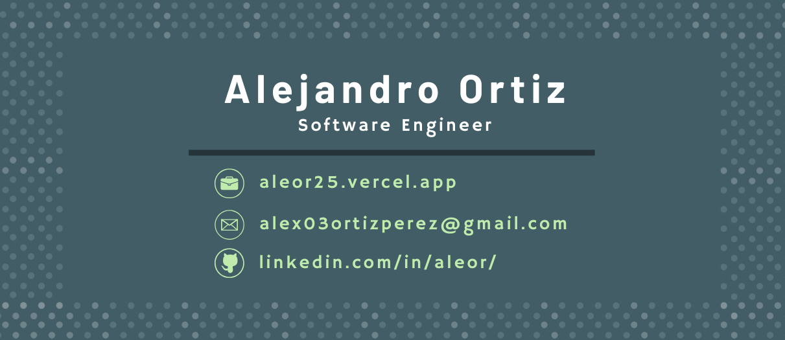

  <a href="README.md">🇺🇸 English</a> | <b>🇲🇽 Español</b>

  

 

## <picture></picture> **Sobre mí**

<picture> </picture>

 

- 🚀 Desarrollador Full-Stack capaz de traducir requerimientos en soluciones escalables.
- 🏭 Fuerte interés en el desarrollo de soluciones para entornos industriales y sistemas críticos.
- 💻 Experiencia comprobable en modernización de sistemas financieros, arquitecturas cliente-servidor y APIs (REST/SOAP).
- 🏆 Participante destacado como Analista Técnico y Desarrollador en el Hackathon Banco Azteca (Azkali).
- 🎓 Próximo a egresar como Ingeniero en Desarrollo y Gestión de Software (UTCV - 2026).

  

  

## <b> Stack Tecnológico & Habilidades</b>
 

- **Backend Development**:
    
    
    
    
    
    

     
    
- **Frontend Development**:

   
   
   
   
   

 

- **Bases de Datos**:

    
    
    
    
    
 

- **Herramientas e Infraestructura**:

    
    
     
    

 
 

-----

 

## <b> Estadísticas de GitHub </b>
 

 
 
 

-----

 
 

## <b> ¡Conectemos!</b>
 

<ul>

<li>
<!-- PON TU ENLACE DE LINKEDIN ABAJO -->

</li>

 

<li>
<!-- PON TU CORREO ABAJO -->

</li>
    
</ul>

 

 
